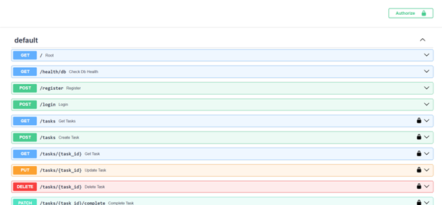
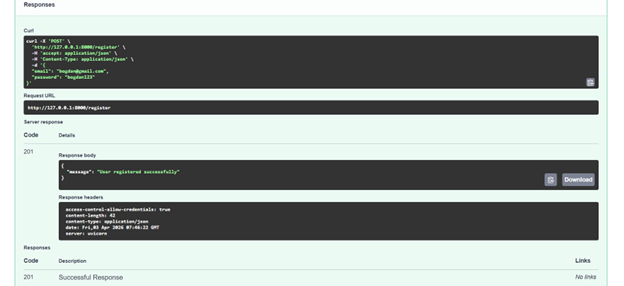
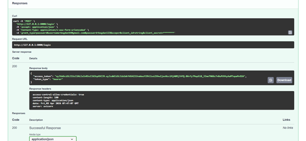
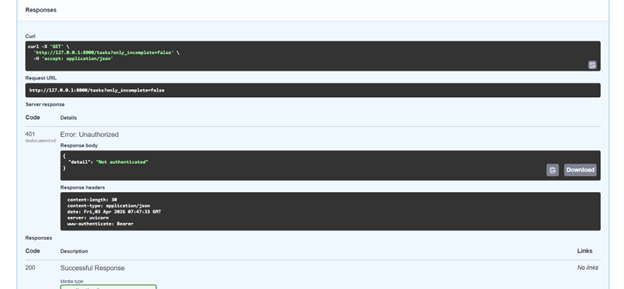
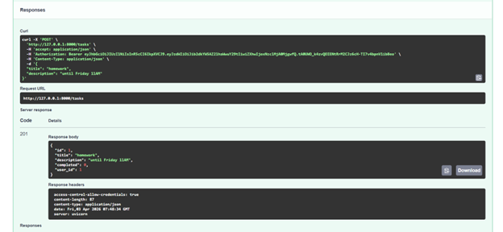
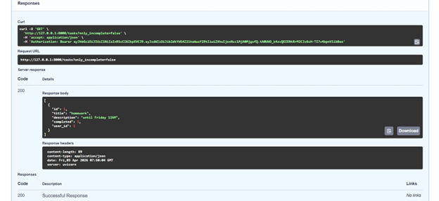
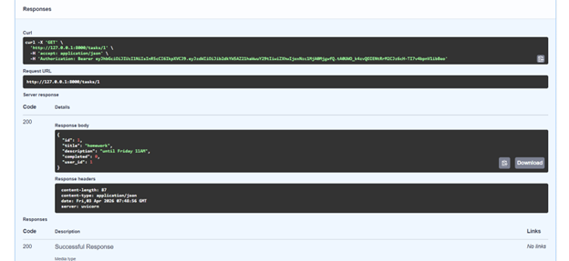
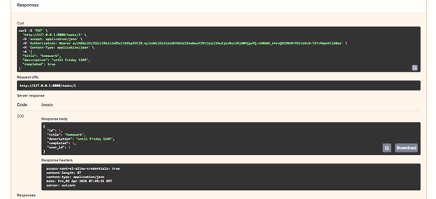

## LAB3 Swagger Screenshots

### Overview of all endpoints
Displays all available routes exposed by the API, including authentication and task management operations.

### Successful user registration (201 Created)
Shows a valid registration request and the success response returned by the API.

### Successful login with JWT token (200 OK)
Demonstrates authentication using valid credentials and the returned bearer token.

### Unauthorized access to protected endpoint (401 Unauthorized)
Shows the response when accessing a protected route without providing a valid token.

### Successful task creation (201 Created)
Shows a valid POST request for creating a new task and the returned task payload.

### Retrieve incomplete tasks with authentication (200 OK)
Demonstrates access to a protected route using a bearer token and filtering tasks by incomplete status.

### Retrieve task by ID (200 OK)
Fetches a specific task using its unique identifier.

### Update task (200 OK)
Updates an existing task and returns the modified task entity.

