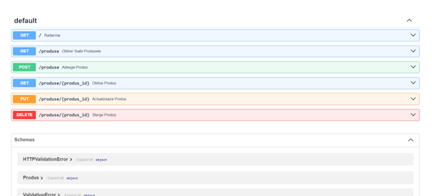
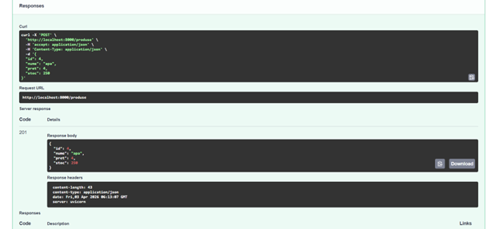
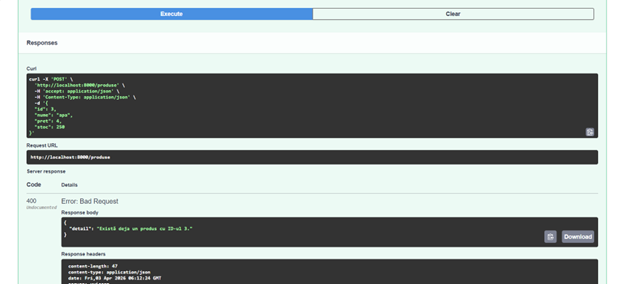
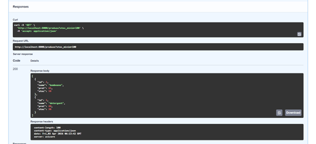
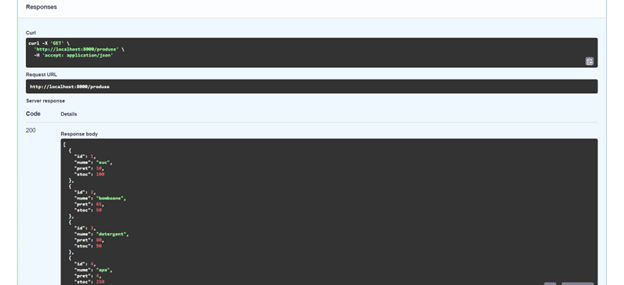
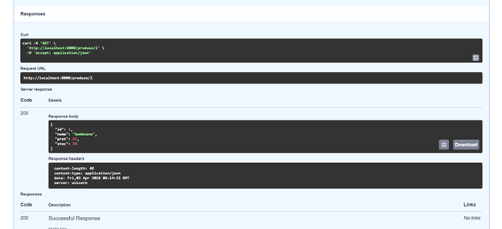
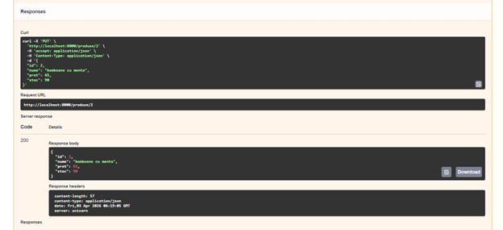
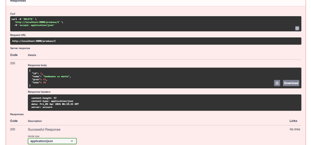
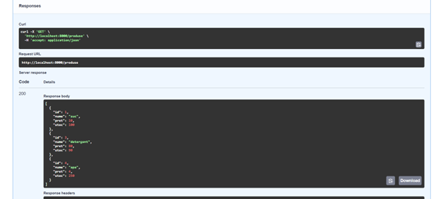

## Swagger Screenshots

### Overview of all endpoints
Displays all available routes (GET, POST, PUT, DELETE) exposed by the API.

### Successful product creation (201 Created)
Shows a valid POST request and the returned product payload.

### Duplicate product error (400 Bad Request)
Demonstrates validation when attempting to create a product with an existing ID.

### Filter products by stock
Example of using query parameter `stoc_minim` to filter results.

### Retrieve all products (GET)
Returns the full list of products stored in memory.

### Retrieve product by ID (GET)
Fetches a specific product using its unique identifier.

### Update product (PUT)
Replaces an existing product with new data.

### Delete product (DELETE)
Removes a product and returns the deleted entity.

### Final state after operations
Shows the updated inventory after multiple operations.
